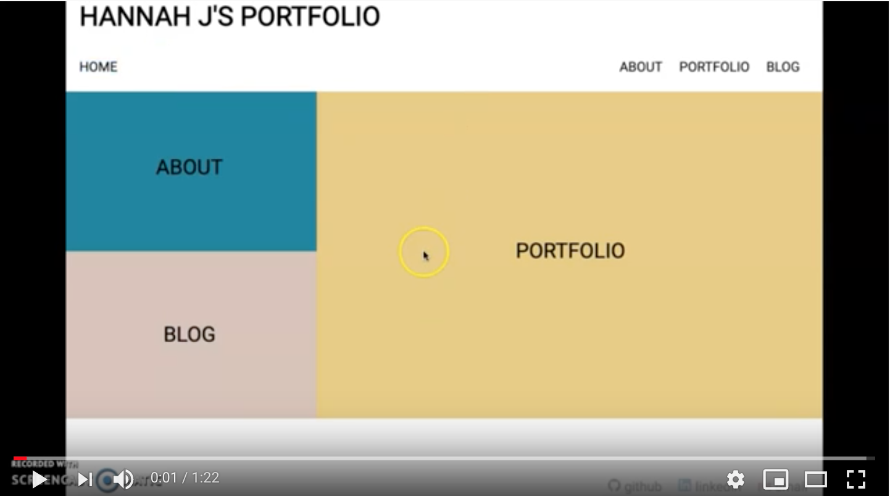

# My Portfolio Site
It's my portfolio site to share my web-dev skills, projects, code journey and interests. 

## Demo video 
To see a demo video, click the screenshot below.

## GitHub Page
The site is published at https://hannah0124.github.io/personal-portfolio-site/

## Related Class
Ada Developers Academy: https://github.com/Ada-C13/personal-portfolio-site

## Built With
* HTML/CSS

## Resources
* Free Images: https://unsplash.com/
* HTML Validator: https://validator.w3.org/#validate_by_upload
